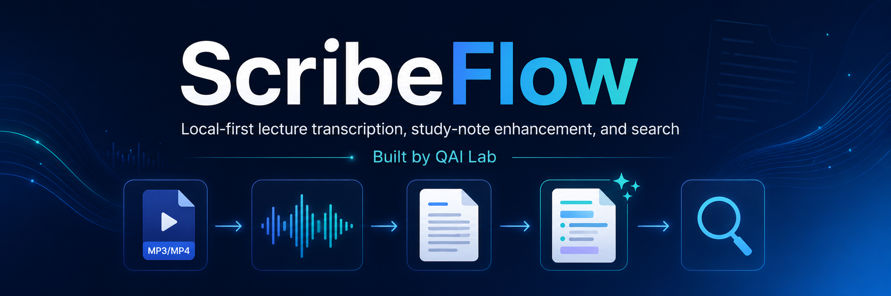

# ScribeFlow

Local-first CLI for converting MP3/MP4 lectures into searchable, timestamped Markdown study notes.

## Overview

ScribeFlow converts local MP3 and MP4 files into:

- normalized WAV audio
- transcript JSON
- timestamped Markdown transcripts
- optional enhanced study notes
- local searchable index

It is designed for local lecture, meeting, and training-material workflows where reproducible processing and private-by-default file handling matter.

## Features

- MP3 and MP4 ingestion
- SHA-256 duplicate detection
- SQLite processing ledger
- FFmpeg audio extraction and normalization
- faster-whisper transcription
- Markdown transcript export
- local deterministic study enhancements
- retry, reprocess, clean, and archive commands
- local SQLite FTS5 search
- no cloud API required

## Installation

macOS/Linux:

```bash
python3.11 -m venv .venv
source .venv/bin/activate
pip install --upgrade pip
pip install -e '.[dev,stt]'
```

Windows PowerShell:

```powershell
py -3.11 -m venv .venv
.venv\Scripts\Activate.ps1
python -m pip install --upgrade pip
pip install -e ".[dev,stt]"
```

## FFmpeg Requirement

FFmpeg is required for media processing. ScribeFlow cannot extract or normalize MP3/MP4 audio without it.

Check FFmpeg:

```bash
ffmpeg -version
```

## Quick Start

```bash
scribeflow init

# Add safe test files:
# inbox/mp3/example.mp3
# inbox/mp4/example.mp4

scribeflow scan
scribeflow status
scribeflow process --limit 1 --model small --language en --enhance
scribeflow status
```

Generated files appear in:

```text
working/audio/
output/raw_json/
output/markdown/
```

## Testing With Real MP3/MP4 Files

Use short safe files first, ideally 30 seconds to 2 minutes.

- Place MP3 files in `inbox/mp3/`.
- Place MP4 files in `inbox/mp4/`.
- Do not commit media files to GitHub.
- Run `git status` before committing.
- Only process recordings you have the right to process.
- Do not commit private, copyrighted, FERPA-protected, HIPAA-protected, or confidential recordings.

## CLI Commands

- `scribeflow version` prints the installed version.
- `scribeflow init` creates workspace folders and local SQLite databases.
- `scribeflow scan` scans inbox folders and registers new MP3/MP4 files.
- `scribeflow status` shows ledger totals and pending files.
- `scribeflow process` runs audio extraction, transcription, JSON export, and Markdown export.
- `scribeflow retry` retries failed jobs.
- `scribeflow reprocess --file <filename>` regenerates outputs for one tracked file.
- `scribeflow clean` removes selected generated working files.
- `scribeflow archive` moves completed source media into archive folders.
- `scribeflow index` builds a local search index.
- `scribeflow search "query"` searches indexed transcript content.

## Process Examples

```bash
scribeflow process --limit 1 --model small --language en
scribeflow process --limit 1 --model small --language en --enhance
scribeflow process --file "lecture.mp3" --model medium --language en
scribeflow process --dry-run
```

## Enhancement Examples

```bash
scribeflow process --enhance
scribeflow process --summary
scribeflow process --terms
scribeflow process --questions
scribeflow process --notes
```

`--enhance` enables summary, study notes, key terms, and study questions.

Enhancement is deterministic and local. It does not use an LLM yet.

## Search Examples

```bash
scribeflow index --rebuild --include-markdown
scribeflow search "machine learning" --limit 10
scribeflow search "sensitivity" --source "machine-learning" --limit 5
scribeflow search "machine learning" --json
```

Search is lexical SQLite FTS5 search, not semantic search.

## Folder Structure

```text
inbox/mp3/             MP3 input files
inbox/mp4/             MP4 input files
working/audio/         normalized WAV files
working/temp/          temporary working files
working/logs/          local processing logs
output/raw_json/       transcript JSON files
output/markdown/       Markdown transcript and study note files
output/subtitles/      reserved subtitle output
archive/completed/     archived completed source media
archive/failed/        archived failed source media
.scribeflow/           local SQLite ledger and search index
```

## Ledger and Duplicate Detection

ScribeFlow uses a local SQLite ledger. It tracks source path, filename, file type, size, SHA-256 hash, status, output paths, retry count, and errors.

SHA-256 hashing prevents duplicate processing even if a file is renamed.

## Status Lifecycle

- `pending`
- `audio_extracted`
- `transcribed`
- `markdown_exported`
- `completed`
- `failed_audio`
- `failed_transcription`
- `failed_export`

## Output Format

```markdown
# Lecture Title

**Source file:** example.mp3
**Media type:** MP3
**Processed:** YYYY-MM-DD HH:MM
**Model:** faster-whisper-small
**Status:** Completed

---

## Summary

- Example summary point.

---

## Study Notes

- Example study note.

---

## Key Terms

- Example term

---

## Study Questions

1. Example question?

---

## Timestamped Transcript

### 00:00:00 - 00:00:05
Transcript text here.
```

## Development

```bash
pip install -e '.[dev,stt]'
pytest
git diff --check
```

## Roadmap

- semantic search
- local RAG/ask
- local LLM summarization
- speaker diarization
- web UI
- course/project folders
- export to Obsidian/Notion-compatible notes

## Limitations

- Transcription accuracy depends on audio quality.
- First faster-whisper run may download model files.
- Search is lexical, not semantic.
- Study enhancements are deterministic and may be basic.
- Requires FFmpeg for media processing.
- Requires SQLite FTS5 for search.

## License

ScribeFlow is released under the MIT License. See [LICENSE](LICENSE).
